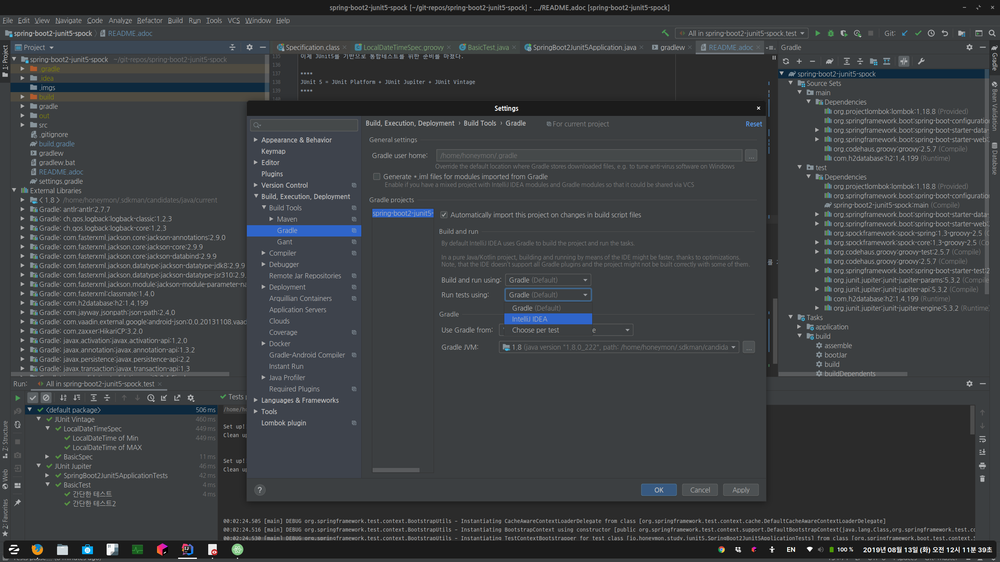
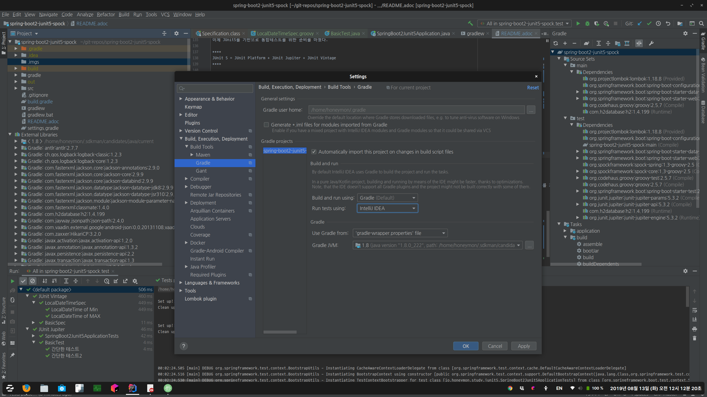
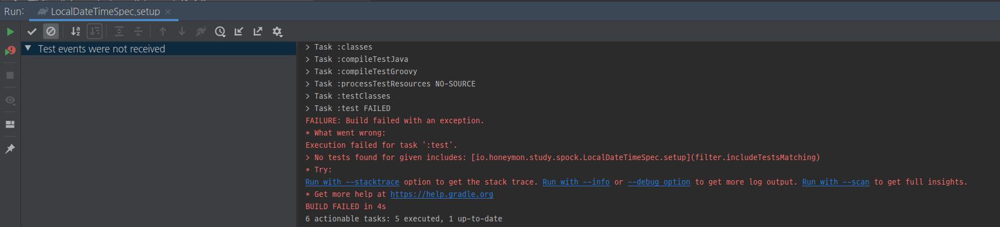

= [spring-boot] Junit5 적용기
honeymon, <ihoneymon@gmail.com>
v0.0.1, 2018-10-18

== JUnit5 의존성 추가
JUnit5가 세상에 모습을 드러내놓은지는 제법 됐다. 새로운 프로젝트를 시작하면서 JUnit5 와 Spock 을 기반으로 한 테스트를 작성하고자 한다.

스프링 부트 2에서 JUnit5 에 대한 의존성을 추가하고 테스트를 작성하는 방법을 설명한다.

[source,groovy]
----
plugins {
    id 'org.springframework.boot' version '2.1.6.RELEASE'
    id 'java'
}

apply plugin: 'io.spring.dependency-management'


group = 'io.honeymon.boot'
version = '0.0.1-SNAPSHOT'
sourceCompatibility = '1.8'

configurations {
    developmentOnly
    runtimeClasspath {
        extendsFrom developmentOnly
    }
    compileOnly {
        extendsFrom annotationProcessor
    }
}

repositories {
    mavenCentral()
}

dependencies {
    implementation 'org.springframework.boot:spring-boot-starter-data-jpa'
    implementation 'org.springframework.boot:spring-boot-starter-security'
    implementation 'org.springframework.boot:spring-boot-starter-web'
    implementation 'org.springframework.boot:spring-boot-starter-thymeleaf'
    compileOnly 'org.projectlombok:lombok'

    developmentOnly 'org.springframework.boot:spring-boot-devtools'

    runtimeOnly 'com.h2database:h2'

    annotationProcessor 'org.springframework.boot:spring-boot-configuration-processor'
    annotationProcessor 'org.projectlombok:lombok'

    testImplementation 'org.springframework.boot:spring-boot-starter-test'
    testImplementation 'org.springframework.security:spring-security-test'
}
----

=== junit4 제외
스프링 부트 스타터 ``org.springframework.boot:spring-boot-starter-test``는 junit4에 대한 의존성을 가지고 있다. 그래서 junit5를 사용하기 위해서는
``spring-boot-starter-test``에 추가되어 있는 ``junit4``를 제외해야 한다.

[source,groovy]
----
testImplementation('org.springframework.boot:spring-boot-starter-test') {
    exclude module: 'junit'
}
----

[NOTE]
====
그레이들에서 모듈에 대한 의존성 정의는 3개 부분으로 나뉜다.

* 예: ``org.springframework.boot:spring-boot-starter-test``
** group: ``org.springframework.boot``
** module: ``spring-boot-starter-test``
** version: 생략

이런 구분을 이해하고 나면 위에서 설명한 제외(``exclude``)방법을 활용할 수 있을 것이다.

* 그룹과 모듈을 정의하는 경우: ``exclude group: 'junit', module: 'junit'`` 으로 정의할 수 있다.
====

이어서 junit5에 대한 의존성을 추가한다.

[source,groovy]
----
dependencies {
    // 생략
    testImplementation('org.junit.jupiter:junit-jupiter-api')
    testCompile('org.junit.jupiter:junit-jupiter-params')
    testRuntime('org.junit.jupiter:junit-jupiter-engine')
    // 생략
}
----

이어서 ``test`` 태스크에서 ``useJUnitPlatform()``를 선언한다. ``useJUnitPlatform``는 테스트 실행시 JUnit 플랫폼(JUnit 5)이라는 것을 정의한다.

[source,java]
----
/**
 * Specifies that JUnit Platform (a.k.a. JUnit 5) should be used to execute the tests. <p> To configure JUnit platform specific options, see {@link #useJUnitPlatform(Action)}.
 *
 * @since 4.6
 */
@Incubating
public void useJUnitPlatform() {
    useJUnitPlatform(Actions.<JUnitPlatformOptions>doNothing());
}
----

이렇게 해서 ``build.gradle``에서 JUnit5를 사용하기 위한 위존성 정리를 마쳤다.

== 테스트 작성
[source,java]
----
package io.honeymon.study.junit5;

import org.junit.jupiter.api.Test;
import org.junit.jupiter.api.extension.ExtendWith;
import org.springframework.boot.test.context.SpringBootTest;
import org.springframework.test.context.junit.jupiter.SpringExtension;

@ExtendWith(SpringExtension.class)  // <1>
@SpringBootTest
public class SpringBoot2Junit5ApplicationTests {

    @Test // <2>
    public void contextLoads() {
    }

}
----
<1> link:https://junit.org/junit5/docs/5.0.3/api/org/junit/jupiter/api/extension/ExtendWith.html[``ExtendWith``]는 JUnit5 에서 반복적으로 실행되는 클래스나 메서드에 선언한다. link:https://docs.spring.io/spring-framework/docs/current/javadoc-api/org/springframework/test/context/junit/jupiter/SpringExtension.html[``SpringExtension``]는 스프링 5에 추가된 JUnit 5의 주피터(Jupiter) 모델에서 스프링 테스트컨텍스트(TestContext)를 사용할 수 있도록 해준다.
<2> ```@Test``의 경로도 변경(``org.junit.Test`` -> ``org.junit.jupiter.api.Test``)되었다.

이제 JUnit5를 기반으로 통합테스트를 위한 준비를 마쳤다.

****
JUnit 5 = JUnit Platform + JUnit Jupiter + JUnit Vintage
****

[NOTE]
====
JUnit5는 람다를 기반으로 한 단언(assertion)을 지원한다. junit4에서 지원했던 기능이 부족하여 assertJ 의존성을 추가해야 했던 불편함을 해소할 수 있다.
====

== Spock 실행환경 구성
`build.gradle` 파일 내에 Spock 에 대한 의존성을 추가한다.

[source]
----
dependencies {
    // 코드 생략
    testImplementation("org.codehaus.groovy:groovy-test")
    testImplementation("org.spockframework:spock-core:1.3-groovy-2.5")
    testImplementation("org.spockframework:spock-spring:1.3-groovy-2.5")
}
----

Spock(현재 1.3, 2019/08)은 JUnit4(JUnit Vintage) 엔진에서 실행된다. link:https://github.com/spockframework/spock#latest-versions[Spock 2.0]부터 JUnit5 를 지원할 것으로 보인다.

[NOTE]
====
Spock 1.3 is the last planned release for 1.x based on JUnit 4. Spock 2.0 will be based on the JUnit 5 Platform and require Java 8/groovy-2.5
====

IntelliJ(2019.2)에서 Spock 을 실행하려면 그레이들 설정을 확인해야 한다.



그림에서 보는 것과 같이 'Run tests using' 항목은 'IntelliJ'를 선택한다.



테스트 실행을 위해 'Gradle'을 선택하면 다음과 같은 화면을 보게 된다.

[source]
----
FAILURE: Build failed with an exception.
* What went wrong:
Execution failed for task ':test'.
> No tests found for given includes: [io.honeymon.study.spock.LocalDateTimeSpec.setup](filter.includeTestsMatching)
----



그레이들 테스트가 실행될 때 JUnit4 로 실행해야 하는데, `build.gradle` 스크립트에 선언한 `useJUnitPlatform()` 으로 JUnit5 가 실행되면서 Spock을 찾지 못하는 것으로 보인다. 반대로 `useJUnitPlatform()` 설정을 제거하면 JUnit5 에 맞춰 작성한 테스트가 실행되지 않는다.

[NOTE]
====
Spock 2.0 이 나오기 전까지, JUnit5 를 실행해야하는 경우에는 Spock(~1.3) 은 빌드 테스트로 실행할 수 없다. ㅠㅅ-)
====

== 참고문서
* link:https://docs.gradle.org/current/userguide/managing_transitive_dependencies.html[Managing Transitive Dependencies - Gradle]
* link:https://junit.org/junit5/[JUnit5]
** link:https://junit.org/junit5/docs/current/user-guide/[JUnit5 User Guide]
** link:http://javacan.tistory.com/entry/JUnit-5-Intro[JUnit5 소개 - JavaCan]
